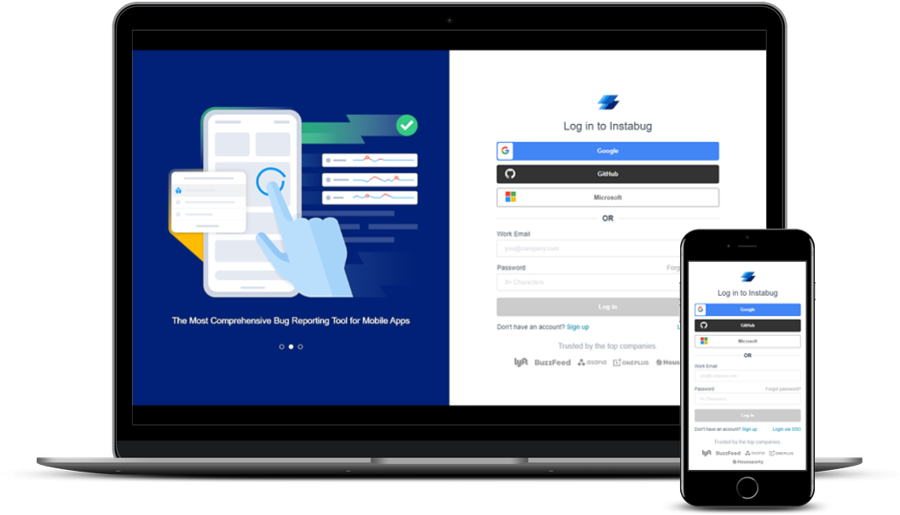

<h1 align="center">Instabug Frontend Intern Task</h1>

## Table of Contents
- [Preview](#preview)
- [Tools](#tools)
- [Checklist](#checklist)
- [Project Setup](#project-setup)

## Preview
<h3 align="center" style="text-decoration: underline">
    <a href="https://aoa97-instabug-task.vercel.app/" target="_blank">Check out the demo here</a>  
</h3>
<div align="center">
    
</div>

## Tools
- Vue CLI (Vue.js Development)
- Vue Router (Routing)
- SASS (CSS Preprocessor)
- Cypress (End-To-End Testing)

## Checklist
- :white_check_mark: Create login page with route/login which contains the login form + slider
- :white_check_mark: welcome screen with route /welcome which will contain a welcome message + logout button
- :white_check_mark: 404 page with route /404 if u entered any route other than the above it redirects to 404 page
- `Redirect rules:`:
    - :white_check_mark: If the entered username and password match any of the above the user should be redirected to the welcome page
    - :white_check_mark: In case the user didn’t log in or he logged out he can’t access the welcome page if he opened it via URL he will be redirected to the login
    - :white_check_mark: In case the user logged once if he opened the login page via the URL it will redirect to the welcome page, Till the user logged out from the welcome page
    - :white_check_mark: The above 2 cases are applied on refresh, open in a new tab, closed the tab and opened it again, closed the browser opened it again
- `Login page:`:
    - :white_check_mark: social login buttons, forgot password, sign up and, log in via SSO links will be implemented without functionality
    - :white_check_mark: The login form will be implemented with the functionality mentioned in the login functionality section
    - :white_check_mark: The left side of the page contains a slider having 3 slides and the slider should switch between slides automatically
- `Login form validations:`:
    - :white_check_mark: The login form consists of 2 fields and one button: User email, password, login password
    - :white_check_mark: The login button is disabled till there are valid values in the other fields
    - :white_check_mark: The email has email validation with text
    - :white_check_mark: The password must be more than 6 characters otherwise shows (password must be six characters or more)
    - :white_check_mark: The password must contain at least 1 uppercase letters and one number and shouldn’t contain the email address name (the part that came before the @)
    - :white_check_mark: If the email or password is incorrect it shows (Your email and/or your password are incorrect)
- `Welcome page:`:
    - :white_check_mark: welcome text “Welcome to {the logged-in user email}
    - :white_check_mark: logout button which has logged-out functionality mentioned in the redirect rules section
- `404 page:`:
    - :white_check_mark: It is shown when the user entered any URL other than the login and welcome URLs
    - :white_check_mark: Shows illustration
- `Login form automation using cypress:`:
    - :white_check_mark: Scenario 1
    - :white_check_mark: Scenario 2
    - :white_check_mark: Scenario 3
    - :white_check_mark: Scenario 4


## Project Setup
```
yarn install
```

### Compiles and hot-reloads for development
```
yarn serve
```

### Compiles and minifies for production
```
yarn build
```

### Run your end-to-end tests
```
yarn test:e2e
```

### Lints and fixes files
```
yarn lint
```

### Customize configuration
See [Configuration Reference](https://cli.vuejs.org/config/).

